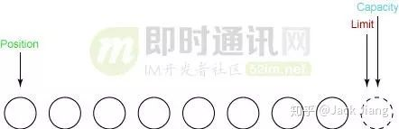
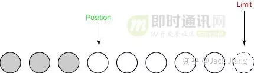
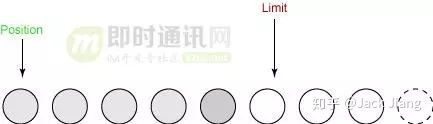
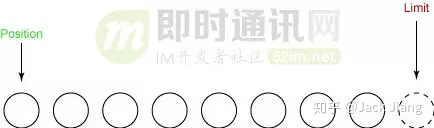

# 聊聊Buffer

​		缓冲区中存在三种状态	

​			1、[position](#Position)

​			2、[limit](#Limit)

​			3、[capacity](#Capacity)

​	这三个变量一起可以跟踪缓冲区的状态和所包含的数据。

## Position

​		position变量主要用于跟踪缓冲区里写了多少数据，更准确的说，**它指定下一个字节将放在数组的位置**。

​		举个例子，如果我们存储3个字节到缓冲区中，那么我们此时得到position等于3，指向第四个元素。

## Limit

​		limit表示还有多少数据需要从缓冲区中取出，或者还有多少数据可以放入缓冲区。

​		**值得注意的是，position总是小于或者等于limit。**

## Capacity

​		capacity表示缓冲区中的最大数据容量，指定了底层数组的大小。

​		limit 绝对不能大于capacity。

​		`ByteBuffer.allocate(int capacity)`就是指定数据容量。此时limit等于capacity。

## flip

​	 	这是Buffer的一个方法。这个方法做两件非常重要的事情：

​		1）将limit设置为当前的position

​		2)  将position设置为0

## clear

​		这是Buffer的一个方法，这个方法做两件非常重要的事情：

​		1) 将limit设置为与capacity相同

​		2)  将position设置为0

## 图解Buffer运作流程

​		我们创建一个总容量为8字节的缓冲区。

​		Buffer的状态如下：

​		

​		由于limit绝对不大于capacity，而且此缓冲区的总量为8字节，所以capacity = limit = 8。我们用可视化的方式来表示。

​		

​		position设置为0。如果我们是读取，那么我们下一个读取的数据就是slot 0。如果我们是写入，那么我们下一个写入的位置就是slot 0。

​		position 设置如下所示：

​		

#### 读取

##### 第一次读取

​		我们假设第一次读取3个字节。由于position的始终指向下一个读取的位置，所以当我们读取完毕后，position等于3。limit，capacity都保持不变。具体如图所示：

​		

##### 第二次读取

​		假设第二次，我们需要读取2个字节。 此时position 等于 5。limit,capacity 都保持不变。具体如图所示：

​		

##### 调用flip()

​		flip作用 ===>  [flip](#flip())

​		调用flip()方法后，position为0，limit为之前position的值，意味着从position到limit之间的数组，就是完整的数据。

​		

##### 调用clear方法

​		clear作用 ===> [clear](#clear)

​		调用clear方法后重设缓冲区，以便可以接受更多的字节。

​		下图显示了调用clear方法后的样子：

​		